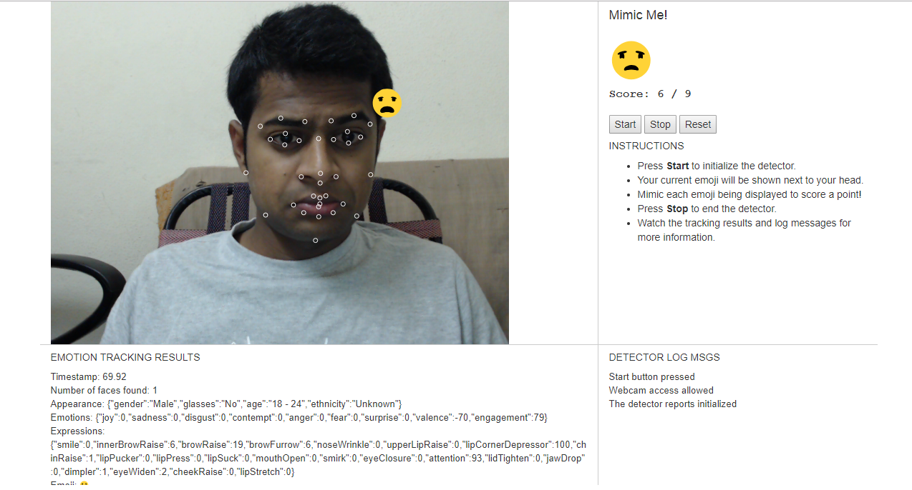

# Project: Mimic Me!


## Overview

A simple fun game built using [Affectiva](http://www.affectiva.com/)’s Emotion-as-a-Service API.
An Emoji is shown on the screen and one has to mimic the emoji to score points. Happy Mimicing!

## Demo


## Affectiva

Visit their [Developer Portal](http://developer.affectiva.com/) and try out some of the sample apps. Affectiva makes it really easy to extract detailed information about faces in an image or video stream. To get a sense for what information you can obtain, check out the [Metrics](http://developer.affectiva.com/metrics/) page.

## How To Run It

### Program Files
There are two files provided for serving your project as a local web application

- **mimic.js**: Javascript file with code that connects to the Affectiva API and processes results.
- **index.html**: Dynamic webpage that displays the video feed and results.
- **mimic.css**: Stylesheet file that defines the layout and presentation for HTML elements.
- **serve.py**: A lightweight Python webserver required to serve the webpage over HTTPS, to can access the webcam feed.
- **generate-pemfile.sh**: A shell script you’ll need to run once to generate an SSL certificate for the webserver.

### Serving locally over HTTPS

In order to access the webcam stream, modern browsers require you to serve your web app over HTTPS. To run locally, you will need to general an SSL certificate (this is a one-time step):

- Open a terminal or command-prompt, and ensure you are inside the `Mimic/` directory.
- Run the following shell script: `generate-pemfile.sh`

This creates an SSL certificate file named `my-ssl-cert.pem` that is used to serve over https.

Now you can launch the server using:

```
python serve.py
```

_Note: The `serve.py` script uses Python 3._

Alternately, you can put your HTML, JS and CSS files on an online platform (such as [JSFiddle](https://jsfiddle.net/)) and run it.

### Running the game

Open a web browser and go to: [https://localhost:4443/](https://localhost:4443/)

- Hit the Start button to initiate face tracking. You may have to give permission for the app to access your webcam.
- Mimic the Emoji shown and score points.

_Note: Your browser may notify you that your connection is not secure - that is because the SSL certificate you just created is not signed by an SSL Certificate Authority‎. This is okay, because we are using it only as a workaround to access the webcam. You can suppress the warning or choose "Proceed Anyway" to open the page._


## What Actually Happens

The code sends frames from your webcam to Affectiva’s cloud-based API and fetches the results. You can see several metrics being reported, including emotions, expressions and the dominant emoji!

## Affectiva Resources

Affectiva's [JS SDK documentation](https://affectiva.readme.io/docs/getting-started-with-the-emotion-sdk-for-javascript).

Other references:

- [Affectiva Developer portal](http://developer.affectiva.com/index.html)
- [Demo](https://jsfiddle.net/affectiva/opyh5e8d/show/) that this project is based on
- Tutorials:
 [Camera stream](https://affectiva.readme.io/docs/analyze-the-camera-stream-3), [video](https://affectiva.readme.io/docs/analyze-a-video-frame-stream-4), [photo](https://affectiva.readme.io/docs/analyze-a-photo-3)
